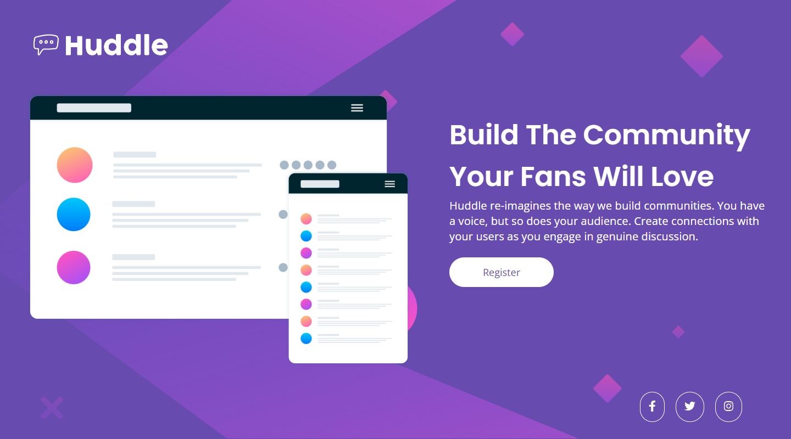
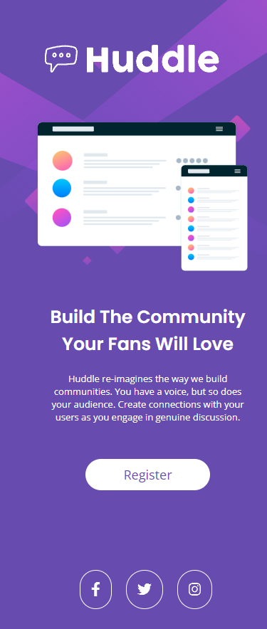
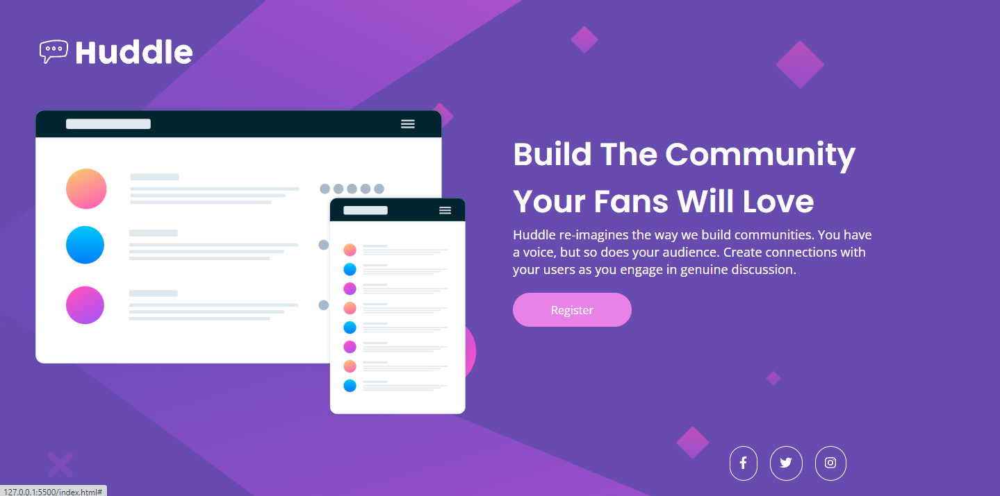

# Português (pt-BR)

# Frontend Mentor - projeto da página inicial do Huddle com uma seção de introdução única

Essa é a resolução do projeto [Huddle landing page with single introductory section challenge on Frontend Mentor] (https://www.frontendmentor.io/challenges/huddle-landing-page-with-a-single-introductory-section-B_2Wvxgi0). O Frontend Mentor ajuda a melhorar nossas capacidades de codificação pois criamos projetos reais. 🚀

## Desafio

- Os usuários devem ver o layout completo em uma página que possui as dimensões 1440px800px e a versão mobile que possui 375px.
- Os usuários devem ver todos elementos interativos da página.

## Screenshots

### Desktop

### Mobile

### Elementos interativos

- Os elementos interativos são um :hover na div register, deixando o fundo com uma cor rosa e as letras brancas e um :hover nas redes sociais, deixando a borda com uma cor rosa e o logo de cada rede social com uma cor rosa.

## Links

- Site: 

## Processo

### Construído com

- Semantic HTML5 markup
- CSS custom properties
- Flexbox
- Css Grid
- Media-querie for mobile version

### O que aprendi

Aprendi como usar algumas das tags semânticas do HTML5, como por exemplo o header, section e o footer. Foi aprendido também como estilizar elementos com o CSS, usando formas como o display:flex e o display:grid, além de utilizar media-queries para deixar o site mais responsivo e fazer a versão mobile dele. Sei que o projeto não está perfeito, mas visto que é o primeiro que eu faço totalmente sozinho, apenas consultando meus resumos e estudos, acredito que tenha ficado razoavelmente bom. Levei um dia e meio para fazer todo o processo, acredito que tenha sido um tempo ok.

### Projetos seguintes

Pretendo continuar fazendo mais projetos, estou seguindo o curso DevQuest e lá existem diversos outros projetos e exercícios a serem feitos. Muito obrigado, Roberto e Ricardo! 😁

### Recursos úteis

Como citado anteriormente, estou fazendo o DevQuest, que me foi muito útil para a realização desse projeto. Ele é fortemente recomendado para quem quer ingressar na área, quem está aprendendo a parte de Frontend e se sente um pouco perdido por onde começar ou até mesmo por onde continuar.

### Autor

- GitHub - [Kevin Desbessell] https://github.com/kevin-desbessell
- Frontend Mentor - https://www.frontendmentor.io/profile/kevin-desbessell
- Instagram - https://www.instagram.com/kevin_desbessell/?next=%2F
- E-mail - kevindesbessell@gmail.com